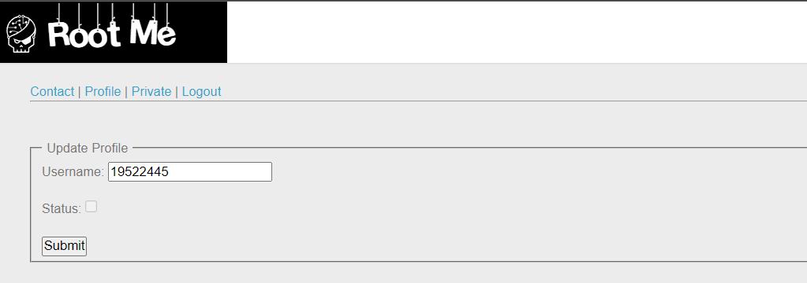
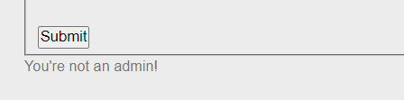
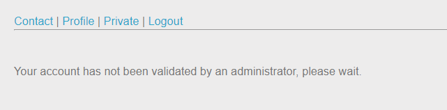
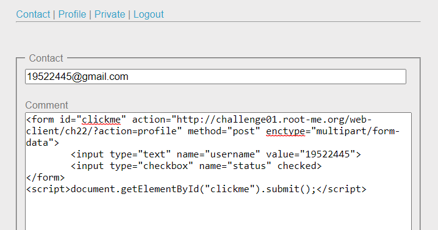
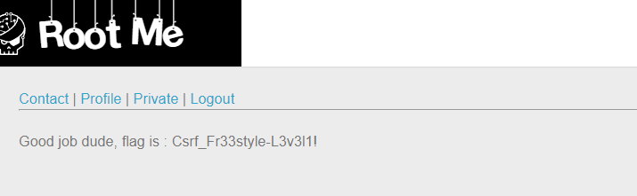

# WRITE UP

**Challenge:** [CSRF - 0 protection](https://www.root-me.org/en/Challenges/Web-Client/CSRF-0-protection)

Tạo tài khoản và login vào website:

Ở tab Profile, khi ta thực hiện submit thử thì nhận được message:

Ở tab Contact, ta có thể thấy form với method=“post”, submit thử thì ta nhận được message:

Qua tab Private, ta thấy message:

Từ đó, ta có thể đoán ra rằng, nội dung ở tab Contact sẽ được post lên và được admin kiểm duyệt Admin có thể click vào message của ta Có thể tấn công CSRF.

Để xem được tab Private, ta cần phải xác thực được Profile và từ đó ta có thể đoán được ý đồ của việc disable của nút Status là có lý do của nó. Tuy vậy, chỉ có admin mới có thể xác thực account. Kết hợp với suy luận ở trên, ta có thể thực hiện CSRF giả mạo gửi content đến cho admin và khiến script chạy để admin submit form cho ta.

Qua tab Profile, inspect element và thực hiện giả mạo một form tương tự form ở tab Profile. Sau đó, chèn thêm script để admin có thể submit form:

&lt;form id="clickme" action="http://challenge01.root-me.org/web-client/ch22/?action=profile" method="post" enctype="multipart/form-data"&gt;

&lt;input type="text" name="username" value="19522445"&gt;

&lt;input type="checkbox" name="status" checked&gt;

&lt;/form&gt;

&lt;script&gt;document.getElementById("clickme").submit();&lt;/script&gt;

Submit để gửi contact đến admin và qua tab Private để kiểm tra kết quả. Sau hơn 1 phút, ta nhận được flag:

\- Flag: \*\*\*\*\*\*\*\*\*\*\*\*\*\*\*\*\*\*\*\*\*\*\*\*\*\*\*\*\*
