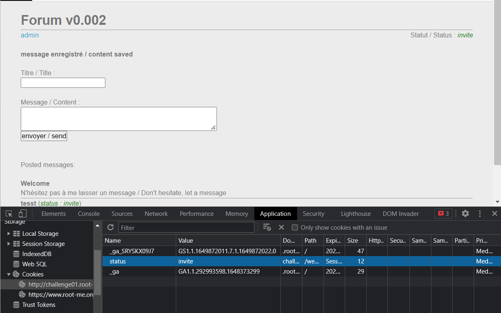

# WRITE UP

**Challenge:** [XSS -- Stored 2](https://www.root-me.org/en/Challenges/Web-Client/XSS-Stored-2)

Thử fuzz các payload ở tab Admin và Post nhưng không có gì xảy ra. Kiểm tra và test thử thì thấy điều đặc biệt là **Status: invite** ở mỗi post.

{width="6.5in" height="3.0145833333333334in"}

Check cookie của website thì thấy nó được handle dựa trên cookie này:

{width="6.5in" height="3.2180555555555554in"}

Bỏ vào repeater và check thử thì thấy nó work:

{width="6.5in" height="3.321527777777778in"}

Ở đây, class "nh4ttruong" sẽ là điểm đích ta tấn công. Thử nhét payload XSS vào thử:

**Payload:** hehe\"\>\<script\>alert(1)\</script**\>**

{width="6.5in" height="1.6125in"}

{width="6.5in" height="1.9715277777777778in"}

Từ đó, ta đã có chỗ để tiêm XSS vào rồi. Tương tự các bài stored, ta tạo request bin và bơm vào:

**Payload:** *\"\>\<script\>document.write(\"\%22))\</script\>*

Cookie trả về có vẻ vẫn chưa nhận được. Nhưng referer trả về ?admin=1&idx=0. Nói lên rằng nó đã đi đúng hướng và admin đã đọc được:

{width="6.5in" height="2.9458333333333333in"}

Mở intercept kiểm tra source với payload tương tự thì phát hiện cookie=status=invite;" kết thúc bằng " ", do đó, rất có thể nó không link được đến cookie của admin

{width="6.5in" height="2.067361111111111in"}

Để giải quyết điều này, ta thử sử dụng hàm REPLACE để xóa bỏ " " và chèn vào ký tự "&" để link các cookie với nhau:

**Payload:** *\"\>\<script\>document.write(\"\%22))\</script\>*

{width="6.5in" height="2.5027777777777778in"}

Có **ADMIN_COOKIE**, ta thay đổi vào cookie và get pass:

{width="6.5in" height="3.91875in"}

{width="6.5in" height="3.2416666666666667in"}

**Flag:** E5HKEGyCXQVsYaehaqeJs0AfV
