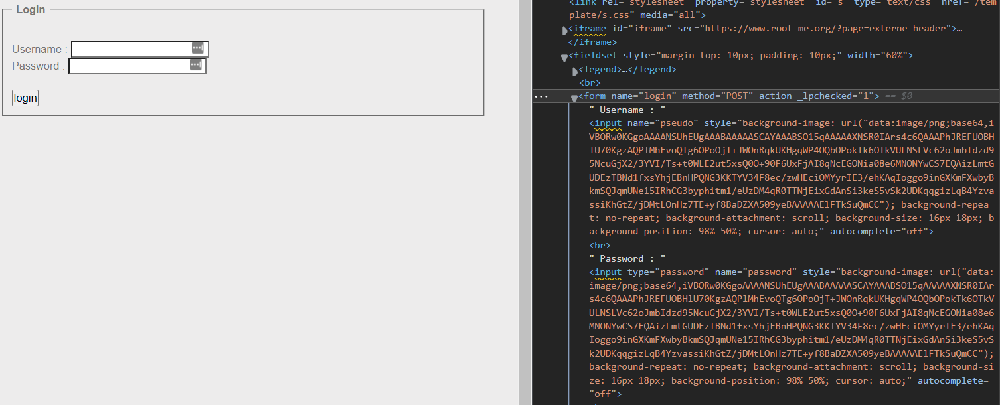
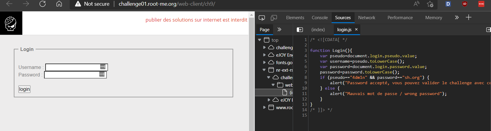

# WRITE UP

## Challenge: [Javascript - Authentication](https://www.root-me.org/en/Challenges/Web-Client/Javascript-Authentication)

Kiểm tra website, ta thấy ở phần Elements không có gì khác biệt:

Chuyển qua phần Sources, ta có thể thấy được file login.js với nội dung:

Có nghĩa, khi nhập đúng **pseudo=="4dm1n" && password=="sh.org"** thì sẽ nhận được alert thành công (cũng không có gì khác biệt). Do đó, ta thử nhập password (flag) với giá trị là **sh.org** thì thấy đã tìm được đúng password.

\- Flag: \*\*\*\*\*\*\*\*\*\*\*\*\*\*\*\*\*
