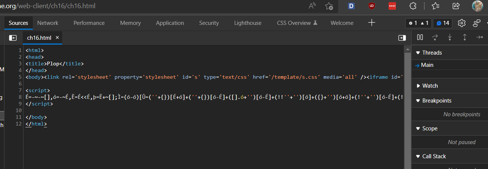
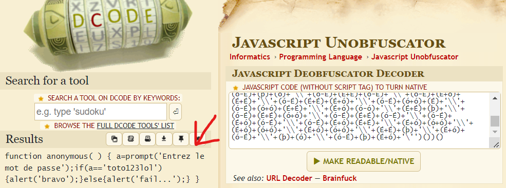

# WRITE UP

## Challenge: [Javascript - Native code](https://www.root-me.org/en/Challenges/Web-Client/Javascript-Native-code)

Kiểm tra Sources website, ta thấy có file ch16.html:

Sử dụng công cụ [Javascript Unobfuscator](https://www.dcode.fr/javascript-unobfuscator) để decrypt đoạn mã trên, ta được:

Từ đó, dễ dàng suy đoán được, password = ‘toto123lol’

\- Flag: \*\*\*\*\*\*\*\*\*\*\*\*\*\*\*\*\*\*\*\*\*
