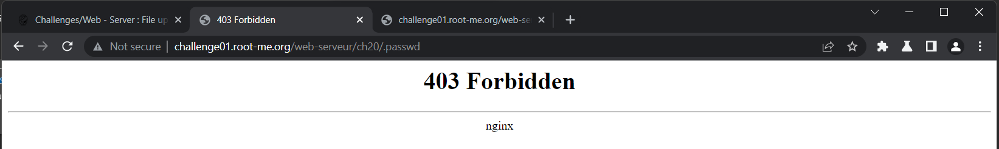
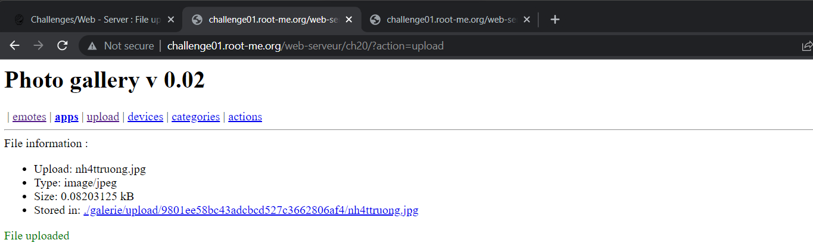
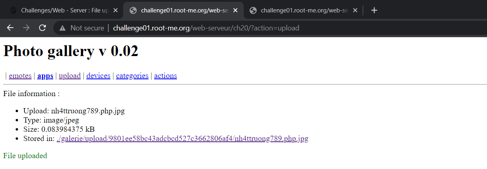
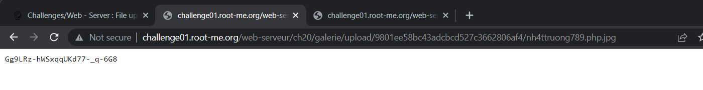
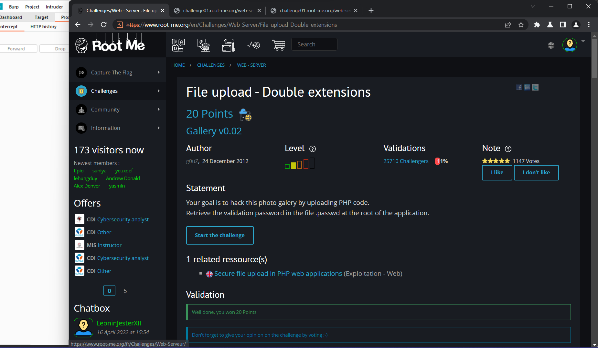

# WRITE UP

**Challenge:** [File upload – Double extensions](https://www.root-me.org/en/Challenges/Web-Server/File-upload-Double-extensions)

Đầu tiên, ta kiểm tra thử xem password của admin sẽ nằm ở đâu. Thử tìm kiếm tại .passwd file thì nhận được lỗi 403 Forbidden Có file này nhưng bị giới hạn access:

Tiếp theo, ta sẽ mở cổng upload của server, ta có thể upload các file image (jpeg/png/gif):

Như vậy, để đọc được .passwd, ta cần phải đi ngược folder 3 lần Vị trí .passwd nằm tại **../../../.passwd**

Để đọc được .passwd, ta thử sử dụng cổng này để upload file .php lên server và buộc server sử dụng shell\_exec() để thực thi shell:

&lt;?php  
$output = shell\_exec('cat ../../../.passwd');  
echo "&lt;pre&gt;$output&lt;/pre&gt;";  
?&gt;

Đề bài đã gợi ý cho ta sử dụng Double Extensions, do đó, thử rename file .php .php.jpg và upload:

Upload thành công, truy cập link và nhận password:

\- Flag: \*\*\*\*\*\*\*\*\*\*\*\*\*\*\*\*\*\*\*\*\*\*\*\*\*\*\*\*\*\*\*\*
