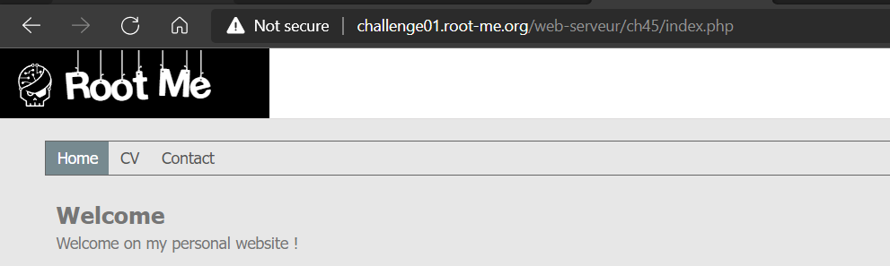
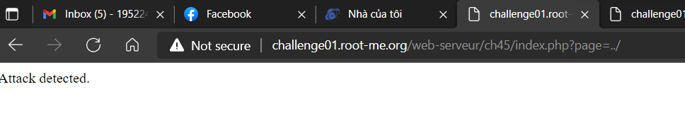
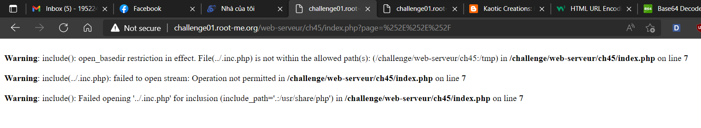
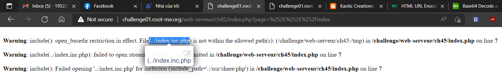
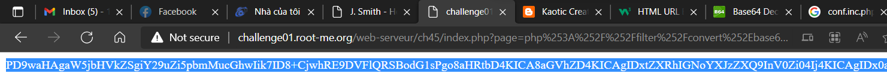
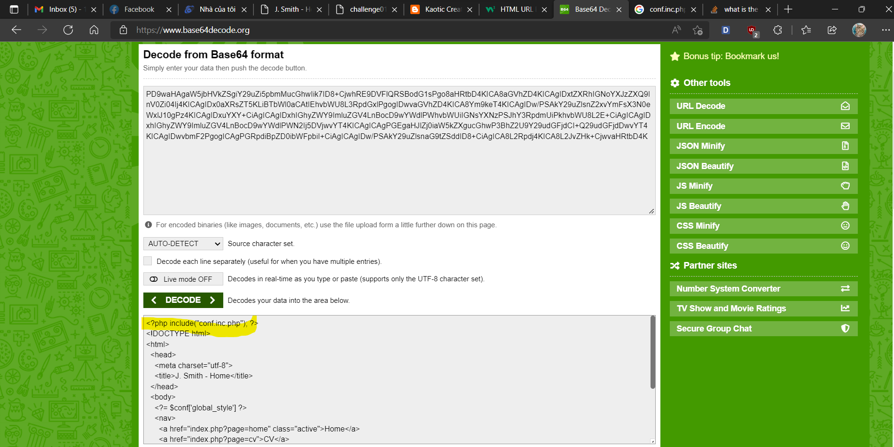
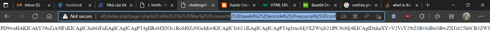
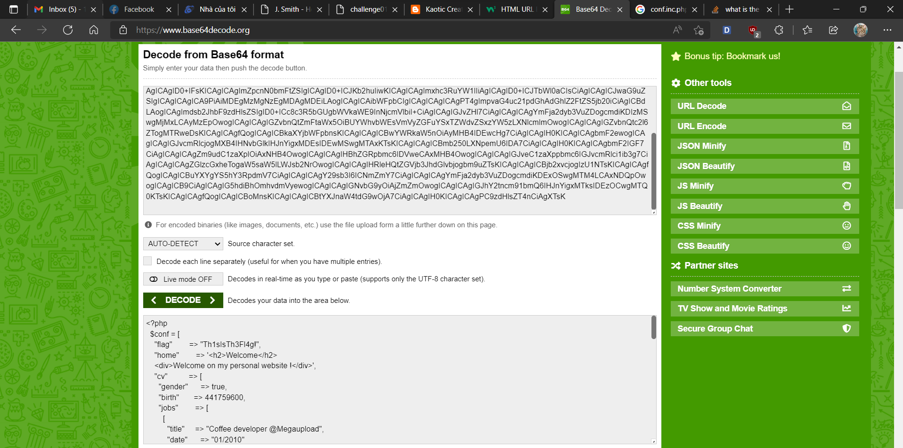

# WRITE UP

**Challenge:** [Local File Inclusion – Double Encoding](https://www.root-me.org/en/Challenges/Web-Server/Local-File-Inclusion-Double-encoding)

Fuzz với Path Traversal, ta thấy web server block hoặc filter ‘../’:

Tên challenge là LFI – Double Encoding URL Double Encoding. Ta convert ../ %252E%252E%252F (%252E = . ; %252F = /)

Đưa vào ?page=\[value\] ta được:

Đến đây, sau khi append bất kỳ text nào thì server sẽ concat text.inc.php:

Dạo quanh index.html và homepage thì không phát hiện bất kỳ điều gì đặc biệt. Tương tự các bài LFI khác, ta cần get source để xem tác giả đặt gì trong web. Khi xem về cách get source php, ta có payload get như sau:

*?page=php://filter/convert.base64-encode/resource=\[source\_file\]*

Giờ thì đưa vào payload ta để get source ở **home.inc.php**:

*?page=php://filter/convert.base64-encode/resource=home*

Double encoding: *?page=php%253A%252F%252Ffilter%252Fconvert%252Ebase64%252Dencode%252Fresource%253Dhome*

Bỏ vào base64 decode:

View source không tìm được gì đặc biệt. Tuy vậy, website đã sử dụng thư viện từ **conf.inc.php**. Từ đó, tiến hành xem thử conf.inc.php:

*?page=php%253A%252F%252Ffilter%252Fconvert%252Ebase64%252Dencode%252Fresource%253Dconf*

Flag xuất hiện trong conf.inc.php:

\- Flag: \*\*\*\*\*\*\*\*\*\*\*\*\*\*\*\*\*\*\*\*\*
