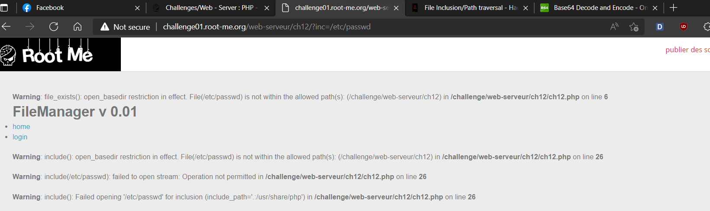
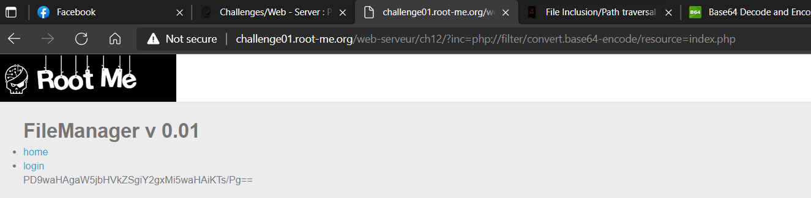
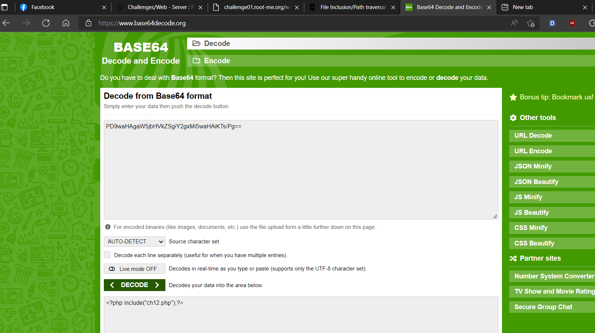
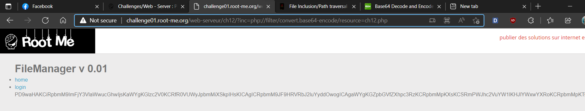
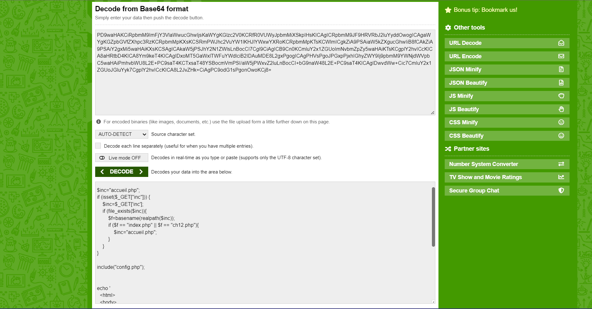
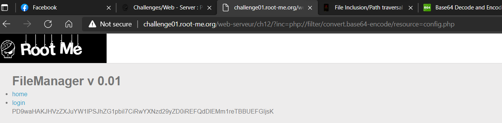
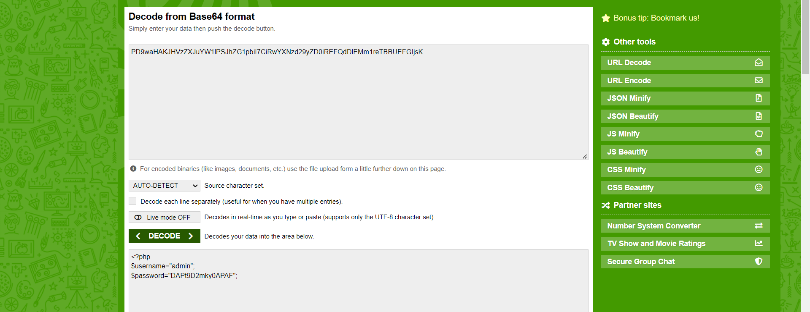
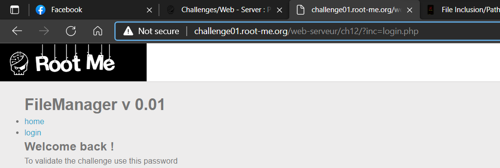
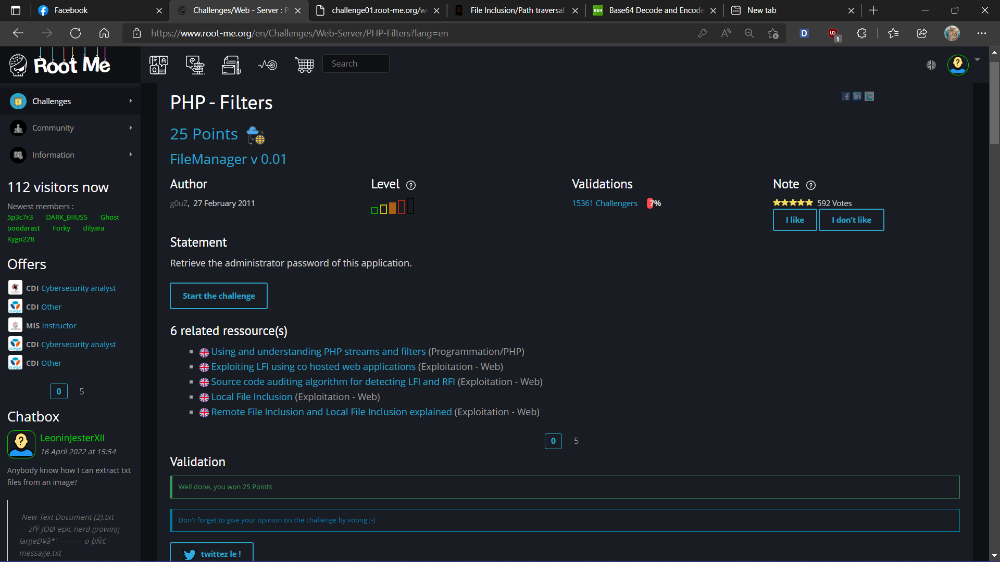

# WRITE UP

**Challenge:** [PHP - Filters](https://www.root-me.org/en/Challenges/Web-Server/PHP-Filters)

Test payload trực tiếp đến /etc/passwd thì nhận được lỗi ràng buộc với /etc/passwd.

Thật ra URL không filter keyword của mình nhưng mà không thể nào get nó theo cách này được. Chuyển qua dùng wrapper php với base64 để get source index.php:

Get source ch12.php:

Vậy là website có config.php, get source config.php:

-   Username: **admin**

-   Password: **DAPt9D2mky0APAF**

\- Flag: \*\*\*\*\*\*\*\*\*\*\*\*\*\*\*\*\*\*\*\*\*\*
