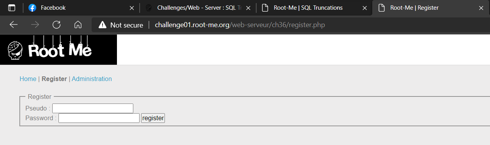
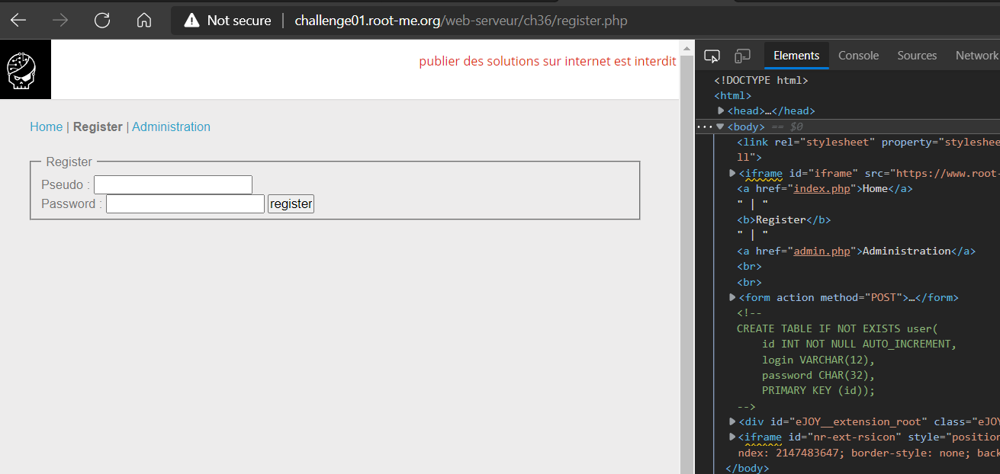
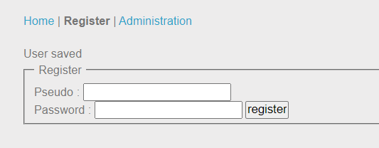
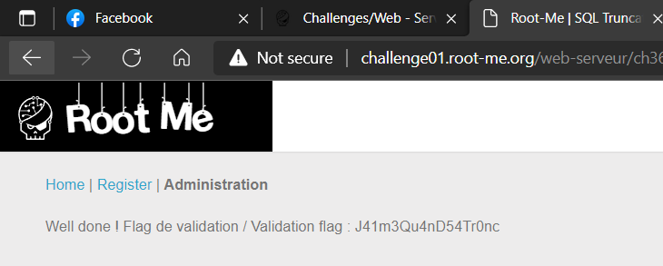

# WRITE UP

**Challenge: [SQL Truncation](https://www.root-me.org/en/Challenges/Web-Server/SQL-Truncation)**

**SQL Truncation** là lỗ hổng xảy ra khi user input vượt qua các điều kiện của database khiến database xung đột và gây ra hiện tượng thiếu xác thực.

Ở challenge này, ta phải mạo danh admin và login vào tab của admin. Đầu tiên, ta kiếm tra sources code và thấy được comment về các query khi register:

Ở username và password, ta có thể thấy, database giới hạng length = 12 (login) và length = 32 (password). Như vậy, ta thử attack vào username với payload:

-   **Username:** admin hehehehe (7 whitespace)

-   **Password:** somethinghere

Khi này, ta nhận được thông báo “User saved”. Theo SQL Truncations, lúc này, thông tin login của ta sẽ bị truncate thành:

-   **Username**: admin

-   **Password (new)**: somethinghere

Ta chuyển qua tab Administrator, login vào bằng password vừa tạo:

Ta nhận được flag sau khi login!

**Flag:** J41m3Qu4nD54Tr0nc

\- Flag:
