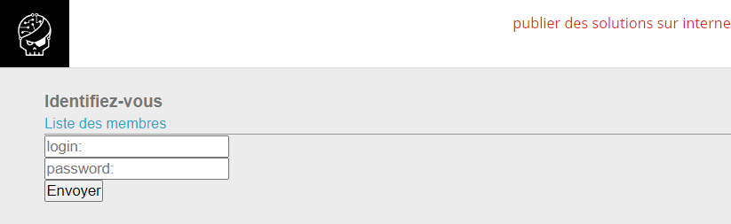
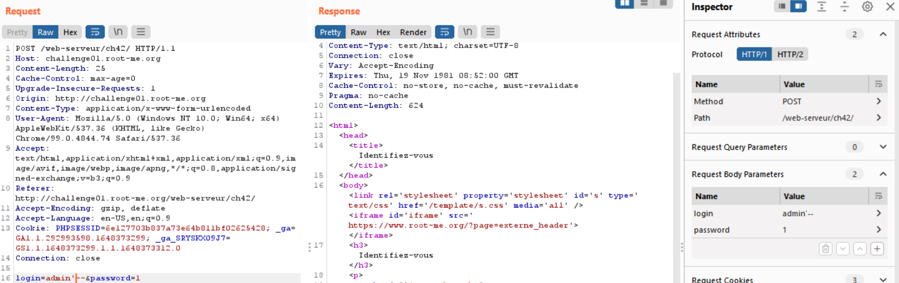
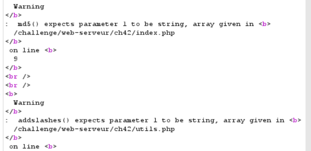
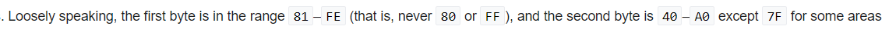
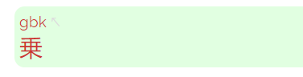
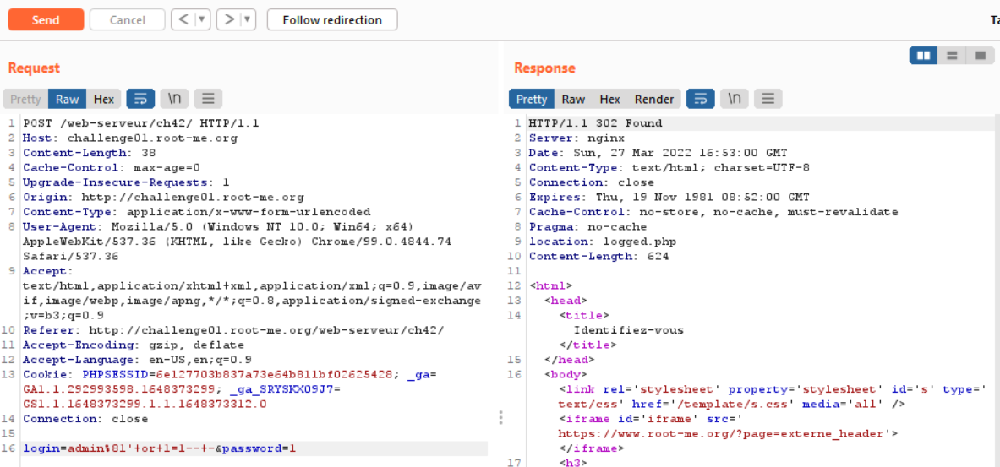
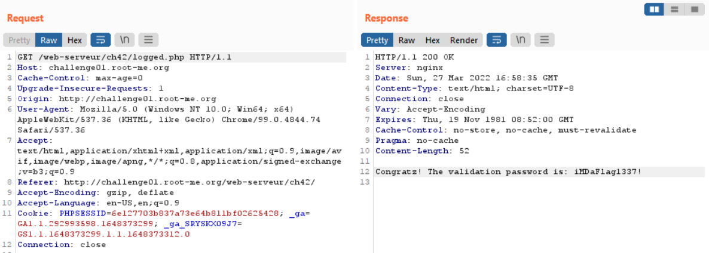

# WRITE UP

**Challenge:** [SQL injection - Authentication - GBK](https://www.root-me.org/en/Challenges/Web-Server/SQL-injection-authentication-GBK)

{width="6.5in" height="1.9979166666666666in"}

Thử với các payload như bài SQLi Authenticaiton thì mọi thứ đã không qua được:

{width="6.5in" height="2.0506944444444444in"}

Thử đổi payload sang **login\[\]=admin&password\[\]=1**, ta nhận được thông báo lỗi sau:

{width="3.7634372265966753in" height="1.824329615048119in"}

Từ đó, ta có thể đoán được password sẽ dùng md5 đã hash và username sử dụng addslashes() để encoding input. Hàm [PHP: addslashes - Manual](https://www.php.net/manual/en/function.addslashes.php) sẽ chèn thêm "\\" trước các ký tự đóng ngoặc đơn để tránh SQL. Từ đó, ta chỉ cần bypass username qua addslashes là có thể SQLi thành công.

Theo GBK, nó sẽ thực hiện mã encoding các ký tự hex về tiếng Trung. Bên cạnh đó, nó sẽ encode 2 bytes hex về 1 ký tự tiếng Trung và tuân theo quy luật ([GBK (character encoding) - Wikipedia](https://en.wikipedia.org/wiki/GBK_(character_encoding))):

{width="6.5in" height="0.24305555555555555in"}

Do đó, ta có thể lợi dụng điều này để khiến server tự động thêm "\\" vào input (1 byte) vào input và từ đó khiến nó trở thành 1 ký tự tiếng Trung:

-   Ký tự '\\' có mã hex là %5C (phù hợp với luận ở byte thứ 2)

-   Vì luật quy định byte đầu tiên trong khoảng 81 -- FE, do đó ta chọn byte đầu là %81

```{=html}
<!-- -->
```
-   Ta có ký tự hoàn chỉnh sau khi nhập %81 vào sẽ được convert sang %81%5c \~ 乗

{width="3.141938976377953in" height="0.8000688976377953in"}

Giờ đến việc inject username, ta thử với payload:

**login=admin%81\'+or+1=1\--+-&password=1**

Dự đoán, server sẽ convert nó thành:

**login=admin%81%5C\'+or+1=1\--+-&password=1**

Hay:

**login=admin**乗**\'+or+1=1\--+-&password=1**

{width="4.886661198600175in" height="2.284096675415573in"}

Sau khi send request, Burp hiển thị Redirection, click vào thì hiển thị flag:

{width="6.5in" height="2.3291666666666666in"}

**Flag:** iMDaFlag1337!
