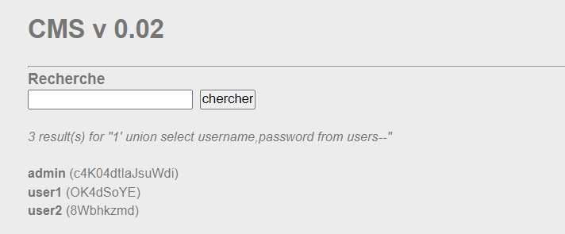

# WRITE UP

**Challenge:** [SQL injection - String](https://www.root-me.org/en/Challenges/Web-Server/SQL-injection-String)

{width="6.5in" height="1.1020833333333333in"}

Thử SQLi ở thẻ Login thì không bypass được, ta qua thẻ Search để thử. Ở thẻ này có vẻ khả thi hơn vì nó có thực hiện query theo input của ta. Ví dụ:

{width="6.5in" height="1.2027777777777777in"}

Đầu tiên, thử với payload đơn giản **1' or 1=1\--** , thì phát hiện nó đã bị SQLi thành công:

{width="6.5in" height="1.59375in"}

Ta thực hiện blind SQL để tìm kiếm thông tin infor của admin để có thể login. Ta thử với payload **1' union select 1** , thì nhận về lỗi sau:

{width="6.5in" height="0.78125in"}

Có thể biết được server sử dụng SQLite3, từ đó, công việc của ta cần sử dụng cú pháp của SQLite3 để mò ra các table trong database với hi vọng tìm được admin. Nhưng trước tiên, ta cần phải thực hiện dò số cột. Thay payload thành **1' union select 1,1\--** thì có vẻ đã tìm được số cột là 2:

{width="3.8753357392825896in" height="1.466793525809274in"}

Vì server dùng SQLite3, do vậy, ta cần truy vẫn các table bằng cách tìm trong **sqlite_master** hoặc **sqlite_schema.** Thử truy vấn với payload **1' union select 1,name from sqlite_master\--** ta có:

{width="5.758832020997375in" height="2.350203412073491in"}

Tiếp tục, ta blind vào table users *1\' union select 1,1 from users\--*

{width="4.967097550306212in" height="1.9585028433945757in"}

Tiếp tục, ta thử query tìm username và password với payload **1\' union select username,password from users\-- :**

{width="5.933847331583552in" height="2.4585465879265094in"}

Thử login thì thành công:

{width="6.5in" height="1.9243055555555555in"}

**Flag:** c4K04dtIaJsuWdi
